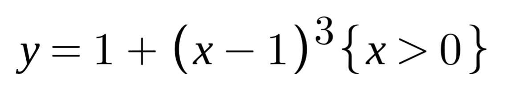

# Parabolic Filter Difficulty Adjustment

Proof of Work difficulty adjustment algorithms are basically aimed at taking a poisson process and altering its parameters so that it approaches clock-like regularity. In order to understand what they are meant to achieve, analogies relating the phenomena of block solution frequency to physical phenomena more familiar to most people.

The simplest, albeit three dimensional, is light. A point light source will emit a photon in every direction around it, and given a grid of a particular scale, one knows at a given point in space, inside a given area perpendicular to the axis with the source, will receive a certain number of photons within a certain amount of time.

In order to focus the light, one uses a parabolic mirror. The parabolic mirror will create a point in space of maximum density formed from the photons emitted in all directions, with some degree of fuzziness to the edge, and if one aims to narrow this down even further, partial mirrors and miniscule apertures give you the laser, which uses a pinhole as a lens instead of a reflector. A lens also achieves the same end, but can be stacked to change the spread and density of the beam.

So, immediately you understand that capturing the output of a random process and focusing it into a linear pattern requires a parabolic geometry to the filter. A parabola is basically anything other than a perfect semicircle or flat circle, and in 3d, for light, lathed into a mirror or from some kind of glass.

However, the distribution of times to solutions is not pure poisson, because, naturally, it is limited by computational precision and the nature of the data. So there is a normal distribution, that peaks around the real hashrate. The hashrate is opaque, none of the participants in the network disclose their hashrates and any such information could not be trusted anyway. Only solutions tell you anything.

So, to help visualise it, and see why the light analogy helps to understand the proper way to approach this problem, is to see the curves:

You can see that the lowest point of the curve crosses through 1,1 and the curve on the right is basically the same as the one on the left except for being squashed to half the width up to 1. The line crosses y=2 at 0.5 and 2.

This is the formula that creates this:

The graph represents the deviation from the target clock tick, whatever the chain sets as the block time interval, in the case of Parallelcoin it is 5 minutes. Because of the nature of the network and the constant shuffling of the peers from each node in the network, there is a trade-off between block time and orphan count.  

As the distribution, while normal, nevertheless can see any given block time has a varying chance of being from one hash rate or another, in proportion to the normal curve (this curve is derived from Gauss's normal distrbiution aka "bell curve") one can precisely compute a difficulty adjustment that has a provable probability of converging on the invisible real network hashrate.

This curve indicates via the height at a given x-axis position how to modify the difficulty in order to adjust it. As more blocks come in, the subsequent adjustments will have an equal chance of hitting the target, and thus compound rapidly. One has a 50/50 chance of being above or below in the first round. Second round adds another 25%, then 12%, and so on. At 3 blocks the likelihood of being within 10% of the target is 90%, and at 10 blocks 99.9% chance, roughly, of being exactly on the target.

## Problems with most existing algorithms

The block time has a very coarse precision, and is compounded with the variance of clocks and the latency of the network and, on top, the blind luck of being close to the origin of a new block as it is first submitted. So the real resolution of the event clock is more like 5 seconds just to account for all the transmission delays. Sometimes two halves of the network are only connected by a few and the message started on the opposite side of the graph. 

The Steem network demonstrates that at best the synchrony of merely 19 nodes is around 3 seconds, likely it could not be much better than this on average given average variance in network latency and so on.

So really, for a 10 minute block our resolution is 200. 5 minutes is 100, 2.5 is 50, so you can easily see the influence of rounding errors will start to creep into the difficulty adjustment. This is also why the Parallelcoin hard fork will not shorten the block time. 

The other problem with Proof of Work and its clock-dependency is that even if the precision was higher, it would only improve the difficulty adjustment marginally, and only if the adjustment algorithm was bumpy instead of smooth. There is naturally aliasing caused by the numbers themselves, and the difficulty regime will amplify them the more linear it is, as each corner behaves like a trap. 

Thus also, as the technique is very effective in digital audio decoding, one can eliminate much of the alias distortion with normalised noise varying the very edge bits a few up and down. To replicate this deterministically, one would just hash the source hash one time, and copy over the lowest bits.

Which brings me to the last issue, the precision of the compressed difficulty target, called 'Bits', provides 23 bits of precision, and for some reason, has a sign bit. So, whatever adjustment is made, the target it must meet has only this much real resolution. Though, it is 8 million places, far more than the clock anyway.

## Pseudocode description

1. Calculate the average block time of some arbitrary, but reasonable number of past blocks. For this we will start with 288, or 24 hours.

2. Divide the average by the target block time. This is the ratio of divergence.

3. The ratio of divergence indicates a y coordinate from the parabolic graph that will be applied to the current difficulty.

4. The y coordinate is multiplied by the current difficulty, with fixed precision of 1 at the 32nd bit meaning 1. Thereby, short blocks will have the target lowered (difficulty raised), and the long blocks will have their difficulty increased, thus increasing the chance the next block will come closer to the target.